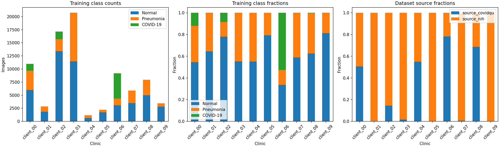

# Phase 1 partition report

Config hash: 54ae8a87cf7cb86dc4b6aa877caf9da817c97a2cfb5faf4562e9e591a4120e1f

Source preferences, within-source Dirichlet draws and shared lognormal volume targets determine whole-group allocation. Train and validation are assigned separately; test stays centralized. Minimum-volume repair may weaken skew for the smallest clients.

```text
   client split  images  Normal  Pneumonia  COVID-19  source_covidqu  source_nih
client_00 train   10972    5985       3670      1317            5547        5425
client_01 train    2860    1847       1012         1               1        2859
client_02 train   17134   13387       2301      1446            2494       14640
client_03 train   20722   11470       9216        36             348       20374
client_04 train    1150     633        517         0             632         518
client_05 train    2200    1744        456         0               0        2200
client_06 train    9189    3086       1268      4835            7186        2003
client_07 train    5897    3471       2425         1              33        5864
client_08 train    7956    4975       2964        17            5469        2487
client_09 train    3448    2805        639         4               4        3444
client_00   val    2397    1141        944       312            1384        1013
client_01   val     625     429        196         0               0         625
client_02   val    3743    2833        503       407             741        3002
client_03   val    4526    2593       1925         8             144        4382
client_04   val     252     155         97         0             157          95
client_05   val     481     391         90         0               0         481
client_06   val    2006     575        259      1172            1705         301
client_07   val    1288     752        536         0               5        1283
client_08   val    1738    1135        600         3            1279         459
client_09   val     753     617        136         0               1         752
```



## Source verification

CheXpert pending registration/files; public cohort only.

See preparation.json for pinned release hashes/counts and split-summary.json for leakage audits.
